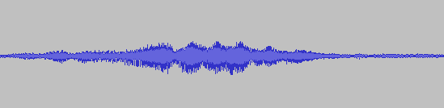
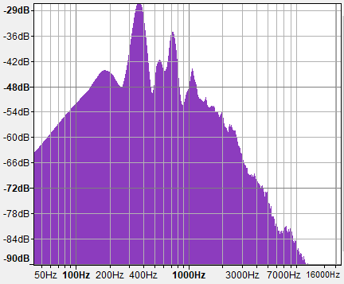
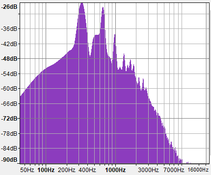
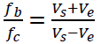

# 🚗 Doppler Speed Predictor 🎯
## Introduction
This program demonstrates how to predict car speed from audio file using the **Doppler Effect** and a MATLAB simulation. 
Frequency analysis is performed on the audio file to determine the detected frequency when the car is approaching and when the car has passed. 
This information can then be fed into the Doppler equation to determine the speed of the car during the pass by using the ratio of the incoming and outgoing frequencies. 

---

## 📡 How It Works

> When a sound source moves relative to an observer, the frequency perceived is shifted. This project uses that principle to reverse-calculate velocity.

### Doppler Shift Equation:
\[
f' = f \left( \frac{v + v_o}{v - v_s} \right)
\]
Where:
- \( f \) = emitted frequency  
- \( f' \) = observed frequency  
- \( v \) = speed of sound  
- \( v_o \), \( v_s \) = velocity of observer/source

The script simulates these parameters and solves for the unknown velocity.

---

## Audio Samples
### Original Audio
 

### Peak Frequency -> Oncoming

Peak frequency approximately 365Hz.

### Peak Frequency -> Outgoing

Peak frequency approximately 328Hz.

## Doppler Equation


* Vs = 343 m/s
* fin = 365 Hz
* fout = 328 Hz

### Frequency Ratio


---

## 🛠️ Tools & Technologies

- 🧮 MATLAB
- 📊 Signal Processing Toolbox
- 📁 .m script files

---

## 🚀 Getting Started

1. Clone the repo:
   ```bash
   git clone https://github.com/Yasteer/Doppler-Speed-Predictor.git
2. Open the main .m file in MATLAB
3. Run the simulation and observe the predicted speed and plots

---

## 💡 Future Ideas
Real-time input from audio files

Integration with a microphone for real-world testing

GUI for user interaction

---

## 📬 Contact
Built with ❤️ by Yasteer
  
